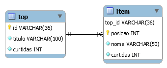

# 🔝 top5-mysql

`Top5` - banco de dados de exemplo em MySQL.

Contém um cadastro de listas do tipo _top 5_ e contagem de curtidas (_likes_).

## Como carregar

Usando o MySQL Workbench, selecione _File_, _Run Script SQL..._.


Selecione o arquivo desejado:

* Somente estrutura, em [`scripts/top5.sql`](scripts/top5.sql)
* Estrutura e dados de exemplo, em [`scripts/top5.production.sql`](scripts/top5.production.sql)

Selecione o conjunto de caracteres `utf8` e execute clicando em _Run_.


_Se preferir, você pode usar outro cliente, como o DBeaver, por exemplo._

## Carregando com Docker

```
docker run -p xxxx:3306 -e MYSQL_ROOT_PASSWORD=yyyy teste
```

Substitua `xxxx` pela porta de acesso desejada, e `yyyy` pela senha desejada para o usuário `root`.

Ou use o Docker Compose para subir juntamente com uma instância do Adminer (senha `secret`, porta 33306).

```
docker-compose up
```

## Modelo de dados

Arquivo do MySQL Workbench: [`model/top5.mwb`](model/top5.mwb)

**Diagrama Entidade-Relacionamento**

